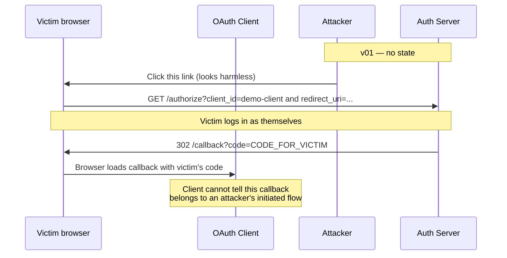

# v02 — OAuth `state` (CSRF protection)

**Status: scaffold only.** This folder is a clone of [v01](../v01-login-and-code/). Behavior is identical to v01 until you implement `state` yourself.

## What v02 adds (your goal)

OAuth **`state`** binds the authorization response to the request that started it. Without it, an attacker can trick a victim's browser into completing a login and landing on the client callback with a `code` issued for the *attacker's* session — a login CSRF / session fixation class of bug.

v02 adds exactly one idea:

1. **Client** generates cryptographically random `state` before redirecting to `/authorize`.
2. **Client** stores `state` (session is fine for this lab).
3. **Server** requires `state` on `/authorize` and passes it back unchanged on the redirect to `{redirect_uri}?code=...&state=...`.
4. **Client** verifies the callback `state` matches what it stored; reject or show error if not.

No PKCE yet (v03). No token endpoint (v05).

## Before you start

Run v01 once so the baseline flow is in muscle memory. Then diff the scaffolds:

```bash
diff -ru versions/v01-login-and-code versions/v02-state-csrf
```

You should see only version labels (`v02` titles, `lab_version` context) — no OAuth logic changes yet.

## The attack v02 fixes (why bother?)



With `state`, the client only accepts a callback whose `state` matches the value *it* generated when *it* sent the user to `/authorize`.

## Implementation plan (do this yourself)

Work in small steps. Commit or note progress after each checkpoint.

### Step 1 — Client: generate and send `state`

**Files:** [`client/app.py`](client/app.py), [`client/templates/index.html`](client/templates/index.html)

- [ ] Before building the authorize URL, generate random `state` (e.g. `secrets.token_urlsafe(32)`).
- [ ] Store `state` in the Flask client session.
- [ ] Add `state=<value>` to the `/authorize` query string on **Start authorization**.

**Hint:** The authorize URL today is hardcoded in `index.html`. You may move URL construction into `app.py` (render template with `authorize_url`) or add a `GET /login` route on the client that sets session + redirects — either pattern is fine.

**Checkpoint:** After clicking Start authorization, the browser should hit:

```
http://localhost:5000/authorize?response_type=code&client_id=demo-client&redirect_uri=http://localhost:5001/callback&state=<random>
```

The server will ignore `state` until Step 2 — that is expected for now.

### Step 2 — Server: require and pass through `state`

**Files:** [`server/routes/authorize.py`](server/routes/authorize.py)

- [ ] Require `state` in the authorize query (return 400 if missing — reuse [`shared/templates/error.html`](../../shared/templates/error.html) like v01 does for other validation errors).
- [ ] Include `state` in the redirect: `{redirect_uri}?code=...&state=...` (use `urlencode` with both keys).
- [ ] Confirm `state` survives the login detour — it should, because v01 already stashes all of `request.args` in `session["authorize_params"]`. Test: hit `/authorize` while logged out, log in, land on callback with the same `state` you started with.

**Do not** store `state` on the authorization code record in `memory.authorization_codes` unless you want to — pass-through is enough for v02. (PKCE will use `code_challenge` in v03.)

**Checkpoint:** Callback URL should look like:

```
http://localhost:5001/callback?code=<random>&state=<same-as-request>
```

### Step 3 — Client: verify `state` on callback

**Files:** [`client/app.py`](client/app.py), [`client/templates/callback.html`](client/templates/callback.html)

- [ ] On `GET /callback`, read `state` from query params.
- [ ] Compare to session-stored `state`.
- [ ] If missing or mismatch: render an error (do not display the code as success).
- [ ] If match: show the code, then clear `state` from session (one-time use).

**Checkpoint:** Normal flow still works. Manually tampering with `?state=wrong` on the callback URL shows an error.

### Step 4 — Manual adversarial test

- [ ] Complete a legitimate flow — still works.
- [ ] Open callback with a valid-looking `code` but wrong `state` — client rejects.
- [ ] Optional: simulate v01-style link without `state` — server should 400 on `/authorize`.

### Step 5 — Docs and polish

- [ ] Update this README: mark v02 **available**, document try-it steps with `state` in the URL.
- [ ] Update [`docs/tutorial-overview.md`](../../docs/tutorial-overview.md) roadmap row for v02.
- [ ] Skim [`docs/blog-learning-oauth-by-building.md`](../../docs/blog-learning-oauth-by-building.md) — dashed “state” lines in the diagram should match what you built.

## Files you will likely touch

| File | Change |
|------|--------|
| `client/app.py` | Session `state`, callback verification |
| `client/templates/index.html` | Authorize URL includes `state` (or link to client route that sets it) |
| `client/templates/callback.html` | Show error on state mismatch |
| `server/routes/authorize.py` | Require `state`, echo on redirect |

Unlikely to need changes for v02:

- `server/routes/login.py` — param resume already preserves all authorize args
- `server/storage/memory.py` — no schema change required
- `server/routes/debug.py` — optional: nothing new to persist

## Acceptance criteria

You are done with v02 when:

1. Client always sends `state` on `/authorize`.
2. Server rejects authorize requests without `state`.
3. Callback URL includes both `code` and `state`.
4. Client rejects callbacks with missing or mismatched `state`.
5. `diff -ru versions/v01-login-and-code versions/v02-state-csrf` shows only the `state`-related changes (plus any refactors you chose, documented in this README).

## Run the scaffold (same as v01 today)

**Terminal 1 — server:**

```bash
cd versions/v02-state-csrf/server
python3 -m venv .venv && source .venv/bin/activate
pip install -r requirements.txt
cp ../../../.env.example .env
python3 app.py
```

**Terminal 2 — client:**

```bash
cd versions/v02-state-csrf/client
python3 -m venv .venv && source .venv/bin/activate
pip install -r requirements.txt
cp ../../../.env.example .env
python3 app.py
```

Until you implement the steps above, behavior matches v01: callback has `code` only, no `state`.

## What's next (v03)

PKCE: `code_verifier`, `code_challenge`, `code_challenge_method=S256` — see [sandbox server authorize](../../sandbox/server/routes/authorize.py) for a rough preview (sandbox bundles state + PKCE together; your v03 should add PKCE on top of your frozen v02).

## References

- [RFC 6749 §4.1.1 — Authorization Request (`state`)](https://datatracker.ietf.org/doc/html/rfc6749#section-4.1.1)
- [RFC 6749 §4.1.2 — Authorization Response (`state`)](https://datatracker.ietf.org/doc/html/rfc6749#section-4.1.2)
- [OAuth 2.0 Simplified — CSRF](https://www.oauth.com/oauth2-servers/accessing-data/authorization-request/)
